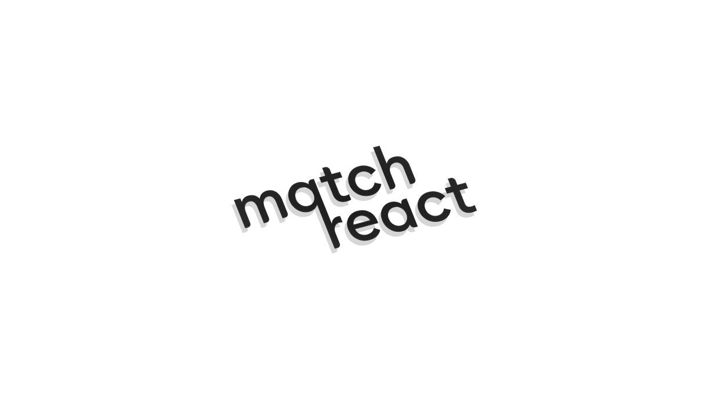

## ⚽matchreact

[]()

## 📸about



a very simple server-side rendered blog application for matchday reactions.

---

## 🌐live demo

matchreact web application - [link](https://matchreact.onrender.com "matchreact url")

---

## 📦features

- [X] secure authentication (JWT)
- [X] database functionality (MySQL)
- [X] user and admin can create posts (/dashboard)
- [X] admin can delete posts in an exclusive page (/dashboard/admin)
- [X] both admin and user can logout (/dashboard/logout)

---

## 🔜coming soon

- [X] more robust features in feed like comments (/dashboard)
- [X] users can filter posts (/dashboard/explore)
- [X] users can view certain analytics (/dashboard/analytics)
- [X] users can edit profile (/dashboard/profile)
- [X] more admin capabilities (/dashboard/admin)

---

## 💻tech stack

###### \<frontend\>


---

###### \<backend\>


---

###### \<deployment\>


---

## 📥clone and run repo

```bash
git clone https://github.com/klausigner/matchreact.git
cd matchreact
npm install
```
